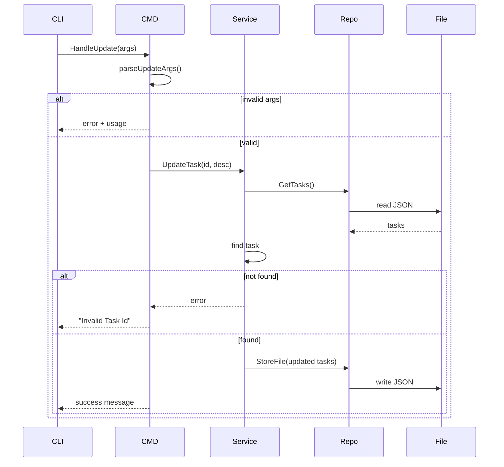

## ✏️ UPDATE TASK

### Usage

```bash
todo update 1 "Buy milk"
```

### Description
A sample solution for the Task Tracker CLI challenge from roadmap.sh.

This project demonstrates a fully type-safe command-line application built in Go, capable of managing tasks (add, update, delete, mark status, and list) with persistent JSON storage.

Challenge: https://roadmap.sh/projects/task-tracker

Updates task description by ID.

### Sequence Diagram


